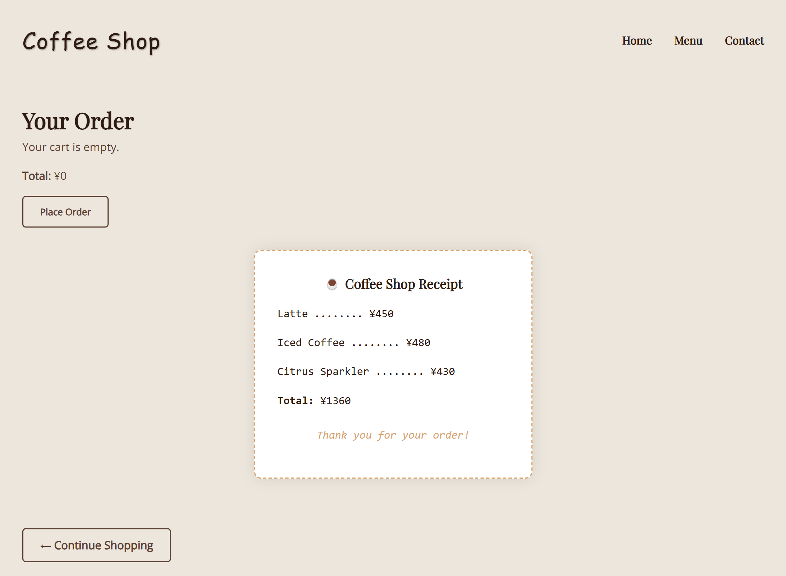

# Coffee Shop Landing Page

A responsive coffee shop website with a dynamic landing page, interactive cart system, rotating news banner, and receipt functionality — all built with HTML, CSS, and JavaScript.

Users can:
- Browse a menu with product images
- Add items to their cart with real-time feedback
- View and manage their cart
- Place an order and receive a styled receipt
- Browse a mobile-friendly design

---

## Table of contents

- [Overview](#overview)
  - [Screenshot](#screenshot)
  - [Links](#links)
- [My Process](#my-process)
  - [Built With](#built-with)
  - [What I Learned](#what-i-learned)
- [Credits](#credits)
- [Author](#author)

---

## Overview

### Screenshot

  
Landing Page

  

  
Cart & Receipt

  

---

### Links

- [GitHub Repo](https://github.com/Lasse-Rodal/Coffee-Shop)
- [Live Demo](https://lasse-rodal.github.io/Coffee-Shop/)

---

## My Process

### Built With

- **Semantic HTML5**
- **CSS3**
  - Responsive layout with grid and flexbox
  - Color palette based on warm coffee tones
  - Glassmorphism and subtle shadows
- **Vanilla JavaScript**
  - Cart system using `localStorage`
  - Event listeners & DOM manipulation
  - Notifications

---

### What I Learned

In this project, I practiced:

- Designing a responsive landing page with visual storytelling
- Building a persistent cart system using `localStorage`
- Creating reusable UI components like toast alerts and rotating banners
- Managing state between multiple HTML pages
- Enhancing UX with animations and confirmation elements (receipt, button pulse)

---

## Credits

### Fonts & Icons
- Fonts by [Google Fonts](https://fonts.google.com/)
- Icons by [Font Awesome](https://fontawesome.com/)

---

## Author

- GitHub – [Lasse Rodal Pedersen](https://github.com/Lasse-Rodal)
